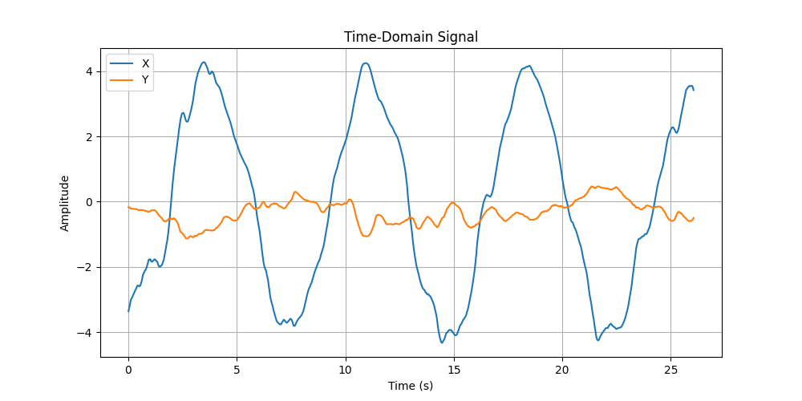
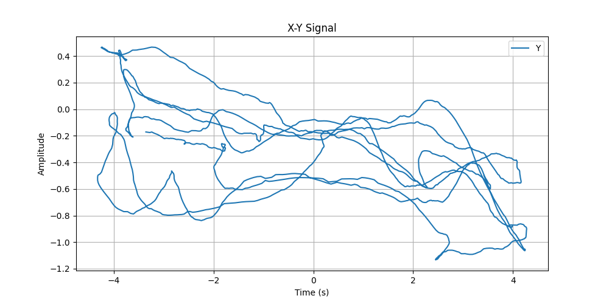
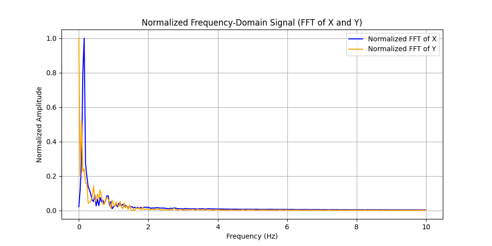
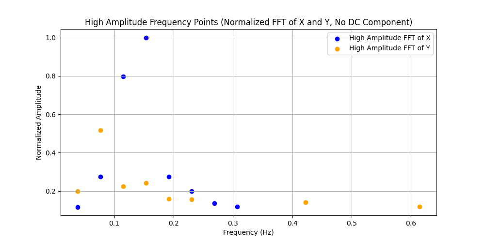
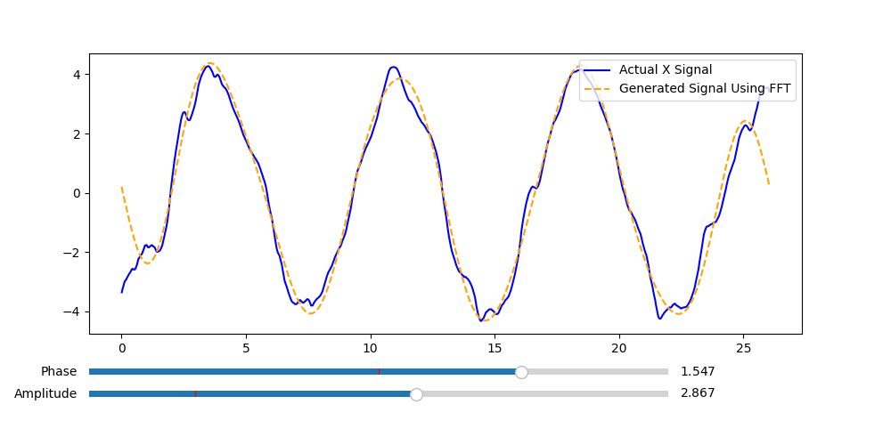

# Signal Frequency Analyzer

This project is a Python-based signal frequency analyzer that processes time-domain signals from a CSV file, performs FFT (Fast Fourier Transform), and visualizes the results. It also allows users to interactively adjust the amplitude and phase of the generated signal using sliders.

---

## Features
- Load time-domain signals from a CSV file.
- Visualize time-domain and X-Y signals.
- Perform FFT to analyze frequency-domain signals.
- Filter high-amplitude frequency points and save them to an output CSV file.
- Generate a sine wave using filtered frequencies, amplitudes, and phases.
- Interactive sliders to adjust amplitude and phase of the generated signal.

---

## Project Structure
```
signal-Frequency-analyzer/
├── input/                  # Folder containing input CSV files
│   └── example.csv         # Example input file
├── output/                 # Folder where output files are saved
│   └── example_output.csv  # Example output file
├── main.py                 # Main Python script
├── screenshot.png          # All screenshot for project
├── requirements.txt        # Python dependencies
└── README.md               # Project documentation
```

---

## Installation

1. Clone the repository:
   ```bash
   git clone https://github.com/your-username/signal-Frequency-analyzer.git
   cd signal-Frequency-analyzer
   ```
2. Install the required dependencies:
   ```bash
   pip install -r requirements.txt
   ```

---

## Usage
1. Place your input CSV file in the input/ folder. The CSV file should have the following columns
   - time: Time values (in seconds).
   - X: Signal values for X.
   - Y: Signal values for Y.
   
  Example CSV file (example.csv):
   ```bash
    time,  X,    Y
    0,    0.1,  0.2
    0.1,  0.15,  0.25
    0.2,  0.2,   0.3
    ...
   ```
 2. Run the script:
    ```
    python main.py
    ```
 3. Select the input CSV file using the file dialog.

 4. The script will:
    - Visualize the time-domain and X-Y signals.
    - Perform FFT and visualize the frequency-domain signals.
    - Save filtered frequency and amplitude data to the output/ folder.
    - Generate a sine wave and allow interactive adjustments using sliders.

---

## Screenshots

### 1. Time-Domain Signal Plot
This plot shows the time-domain signals for `X` and `Y` over time.


### 2. X-Y Signal Plot
This plot visualizes the relationship between `X` and `Y` signals.


### 3. Normalized Frequency-Domain Signal (FFT)
This plot shows the normalized FFT of `X` and `Y` signals in the frequency domain.


### 4. High-Amplitude Frequency Points
This scatter plot highlights the high-amplitude frequency points for `X` and `Y` signals after filtering.


### 5. Interactive Signal Generation
This plot allows users to interactively adjust the amplitude and phase of the generated signal using sliders.


---

## Output
The filtered frequency and amplitude data are saved in the output/ folder. Example output file (example_output.csv):

  ```
  Frequency_X,Amplitude_X,Frequency_Y,Amplitude_Y
  1.0        ,0.8,        1.0,        0.7
  2.0,        0.6,        2.0,        0.5
  ...
  ```
---

## Dependencies
The project requires the following Python libraries:
   - numpy
   - pandas
   - matplotlib
   - tkinter
